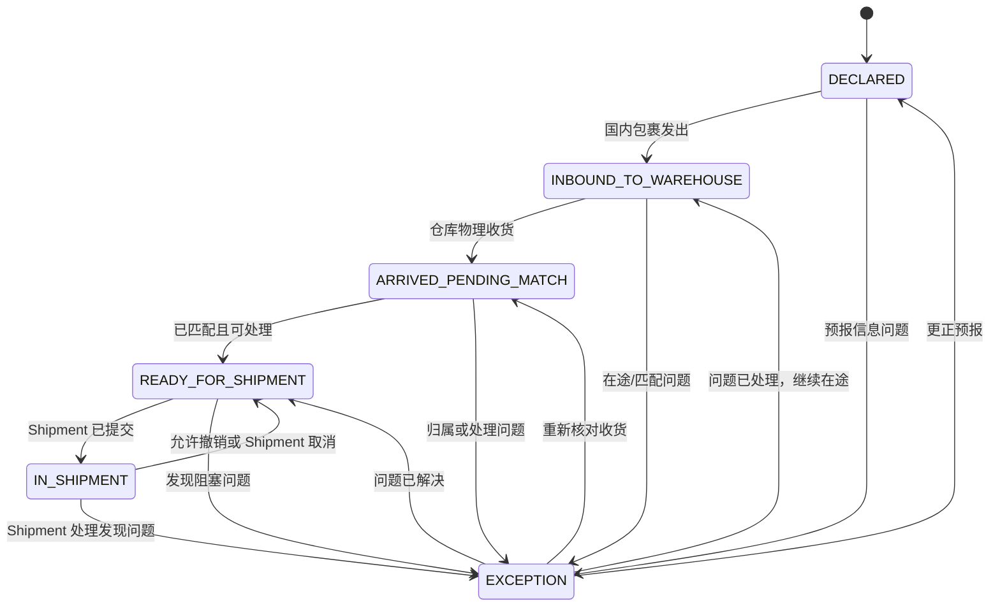
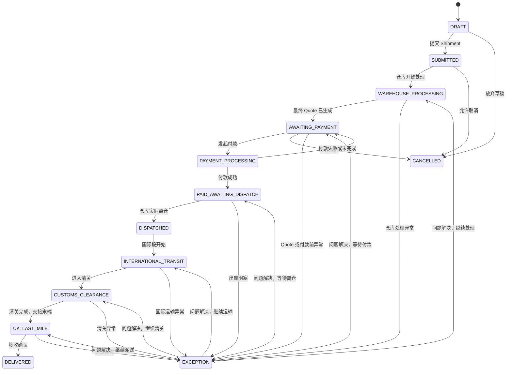

# 状态机

> 状态机描述用户可理解的业务事实，不等于数据库实现或外部服务的原始事件码。真实状态来源、触发时机和异常规则仍需由业务确认；作品集 V1 以明确标记的模拟事件展示外部状态。

## Package State

Package 状态只解决“这件物品是否已被确认、能否进入某次 Shipment”的问题。它不承担跨境签收的完整履约表达；Package 加入 Shipment 后，用户以 Shipment 状态为主要追踪入口。

| State | 用户看到的含义 | 触发者 | 进入条件 | 可去状态 |
| --- | --- | --- | --- | --- |
| `DECLARED` | 已预报，等待国内包裹前往仓库 | User / System | 用户提交最小预报信息 | `INBOUND_TO_WAREHOUSE`、`EXCEPTION` |
| `INBOUND_TO_WAREHOUSE` | 正在送往仓库 | System / User | 国内包裹已发出或用户更新在途信息 **[Product Assumption]** | `ARRIVED_PENDING_MATCH`、`EXCEPTION` |
| `ARRIVED_PENDING_MATCH` | 仓库已收货，正在确认归属/可处理性 | Warehouse / System | 仓库记录物理收货，但尚未完成用户匹配或处理检查 | `READY_FOR_SHIPMENT`、`EXCEPTION` |
| `READY_FOR_SHIPMENT` | 已确认归属，可选择加入本次 Shipment | Warehouse / System | Package 已归属用户，且没有阻塞性 Exception | `IN_SHIPMENT`、`EXCEPTION` |
| `IN_SHIPMENT` | 已加入一次已提交的 Shipment | System | 用户提交 Shipment，且该 Package 被其中包含 | `READY_FOR_SHIPMENT`（仅在允许撤销/取消时）、`EXCEPTION` |
| `EXCEPTION` | 此 Package 需要处理，暂不可按正常路径继续 | Warehouse / System / User | 信息不匹配、无法处理或其他阻塞问题 **[Product Assumption]** | 回到产生问题前的适当状态 |

### Package 状态图



## Shipment State

Shipment 状态表达一次跨境寄送请求的完整生命周期。

### 关键约束

- `PAID_AWAITING_DISPATCH` 表示支付已成功，**不等于已离仓**；
- `DISPATCHED` 表示仓库已实际离仓，**不等于国际运输完成或英国签收**；
- 只有 `DELIVERED` 才表示完整履约结束；
- `EXCEPTION` 是需要用户理解影响和下一步的状态，不等于自动取消；
- `CANCELLED` 只允许在实际离仓前出现，具体修改/取消窗口见 [07-business-rules.md](07-business-rules.md)。

| State | 用户看到的含义 | 触发者 | 进入条件 | 下一步 |
| --- | --- | --- | --- | --- |
| `DRAFT` | 正在选择本次要寄的 Package，尚未提交 | User | 已创建 Shipment 草稿 | 继续修改或提交 |
| `SUBMITTED` | 已提交，等待仓库开始处理 | User / System | 用户确认 Package 和地址并提交 | 等待仓库处理 |
| `WAREHOUSE_PROCESSING` | 仓库正在检查、打包和称重 | Warehouse / System | 仓库接受并开始处理 | 等待 Quote 或处理 Exception |
| `AWAITING_PAYMENT` | 最终 Quote 已生成，等待付款 | System | 最终重量和 Quote 已就绪 | 查看 Quote 并付款 |
| `PAYMENT_PROCESSING` | 正在确认付款结果 | Payment / System | 用户发起付款 | 等待成功或失败结果 |
| `PAID_AWAITING_DISPATCH` | 已付款，等待仓库实际离仓 | Payment / System | Payment 成功 | 查看离仓状态 |
| `DISPATCHED` | 已离开仓库，已交接后续运输 | Warehouse / System | Warehouse 记录离仓事件 | 查看国际运输进展 |
| `INTERNATIONAL_TRANSIT` | 正在国际运输 | Carrier / System | 获得国际段事件 | 等待清关或后续事件 |
| `CUSTOMS_CLEARANCE` | 正在清关 | Carrier / System | 获得清关阶段事件 | 等待放行或 Exception |
| `UK_LAST_MILE` | 已进入英国本地派送 | Carrier / System | 获得末端承运商派送事件 | 等待签收或 Exception |
| `DELIVERED` | 已签收，履约完成 | Carrier / System | 获得签收事件 | 查看历史记录 |
| `EXCEPTION` | 当前问题影响 Shipment，需要查看原因和下一步 | System / Warehouse / Carrier | 任一阶段出现阻塞或异常事件 | 查看行动指引，处理后恢复适当阶段 |
| `CANCELLED` | 本次 Shipment 在离仓前已取消 | User / System | 符合取消规则 | Package 依规则回到可选状态 |

### Shipment 状态图



### 用户可见的状态层级

为避免把过多内部状态直接暴露给用户，V1 可将以上状态归纳为：

```text
准备提交 → 仓库处理中 → 待付款 → 已付款待离仓 → 已离仓
→ 国际运输 → 清关中 → 英国派送 → 已签收
```

如有 `EXCEPTION`，优先显示异常影响与下一步，而不是只显示一个模糊的“异常”。内部状态和用户文案的最终映射仍应通过原型测试校准。
