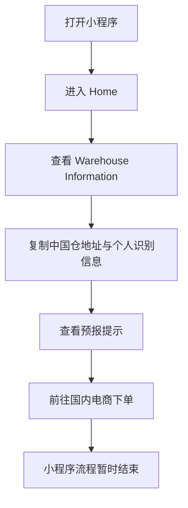
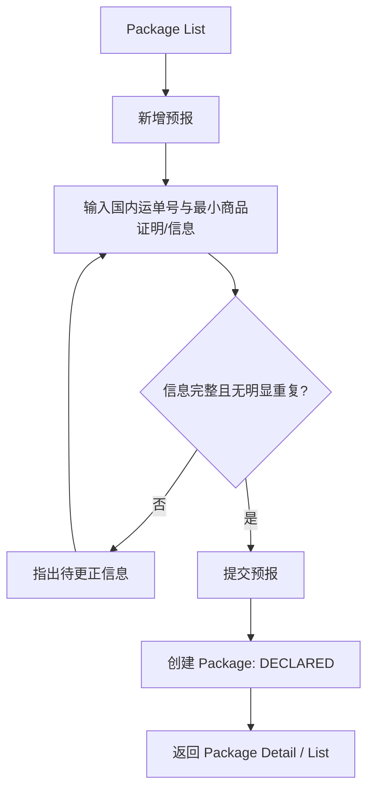
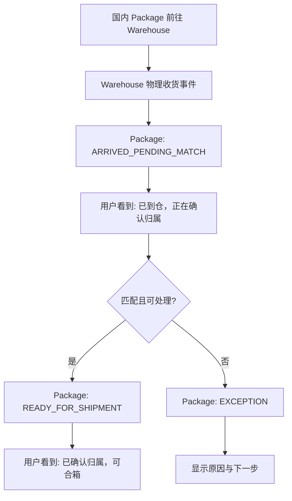
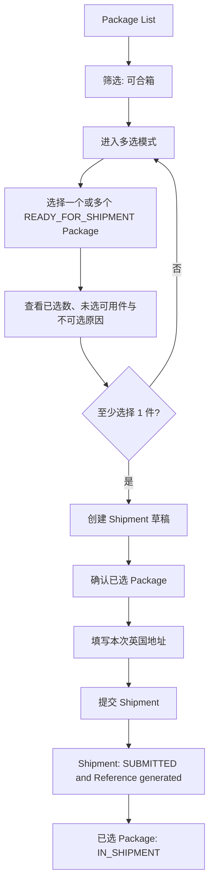
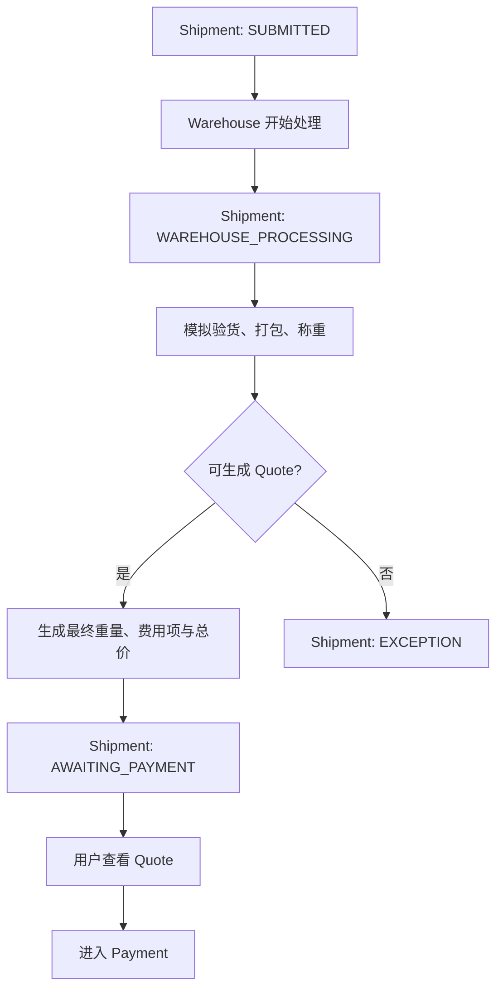
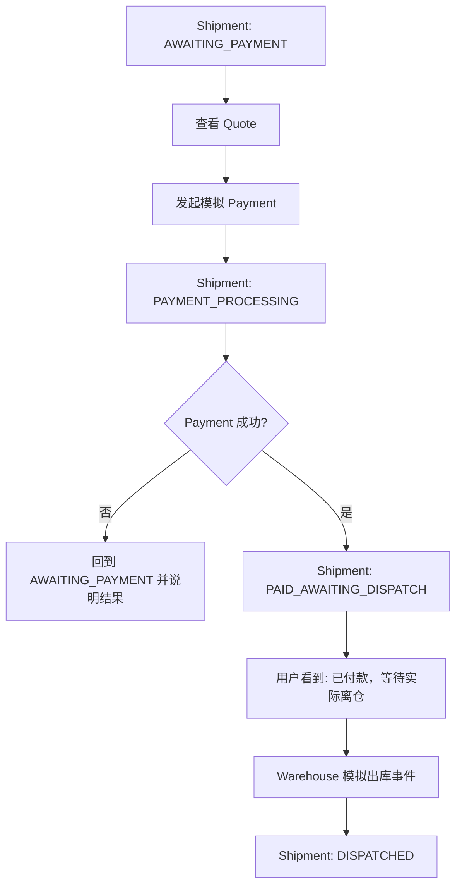
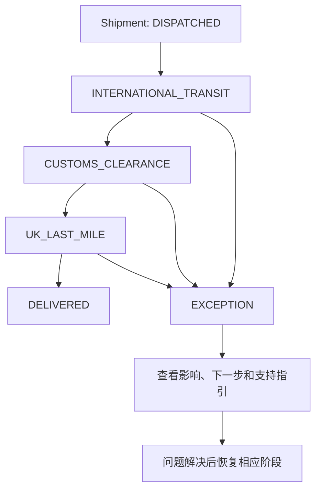
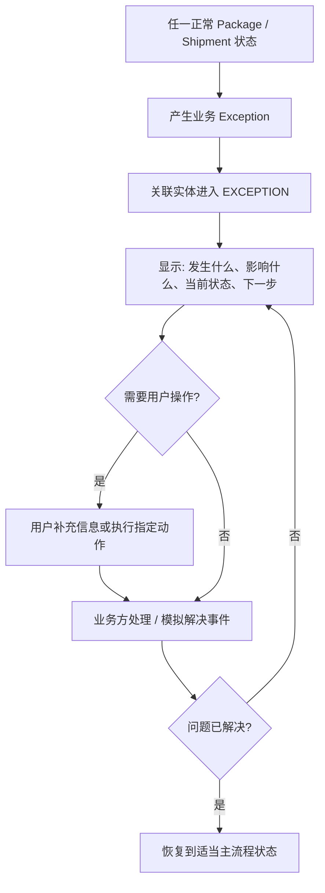

# 核心用户任务流

> 以下仅覆盖已冻结 V1 的核心闭环。Warehouse、Payment、国际运输与末端事件在作品集 V1 中可模拟；用户侧的实体关系、状态变化和行动逻辑必须保持真实一致。所有 Flow 都以 Package 与 Shipment 为不同对象。

## Flow 1：首次使用 / 获取 Warehouse 地址

| 项目 | 定义 |
| --- | --- |
| Entry | 首次打开小程序，或无 Package 时从 Home 进入 Warehouse Information。 |
| User Goal | 获得可用于淘宝、拼多多等外部电商下单的中国仓地址。 |
| User Actions | 查看地址和个人识别信息；复制；理解下单后需要回到小程序预报 Package。 |
| System Response | 展示 Warehouse 信息、填写说明与最小预报提示。 |
| State Change | 无 Package / Shipment 状态变化。 |
| Decision Point | 用户是否已在外部电商下单？若未下单，小程序不强迫创建 Package。 |
| Exception / Edge Case | 地址或识别规则不可用时，应显示业务 Exception 与支持指引；不显示过期或编造地址。 |
| Exit | 用户复制地址并进入外部电商。外部购买不属于小程序流程；下一次入口是 Package 预报。 |

## Flow 2：Package 预报

| 项目 | 定义 |
| --- | --- |
| Entry | Package List、无 Package 的空状态，或用户完成外部电商下单后返回。 |
| User Goal | 让 Warehouse 能够识别即将到仓的 Package。 |
| User Actions | 输入国内运单号；提交 P01 使用的最小订单截图/商品证明；确认预报。 |
| System Response | 校验必填信息和明显重复；创建 Package，并说明“已预报，不代表已到仓”。 |
| State Change | `Package: DECLARED`。 |
| Decision Point | 信息是否足以提交；若已有相同有效运单号，则阻止重复创建并引导查看已有 Package。 |
| Exception / Edge Case | 预报信息不匹配、需要补充或后续无法匹配时，进入 `Package: EXCEPTION`；“是否每件均必须预报”仍是 Product Assumption。 |
| Exit | 用户看到已预报 Package，等待国内包裹前往 Warehouse。 |

## Flow 3：Package 到仓与确认

| 项目 | 定义 |
| --- | --- |
| Entry | Warehouse 到仓事件；用户也可从 Package List / Detail 查看已有状态。 |
| User Goal | 确认国内物流签收后，Package 是否真正被 Warehouse 收到、匹配到自己并可合箱。 |
| User Actions | 查看状态、最近事件与不可选原因；只有有明确要求时才补充信息。 |
| System Response | 将“物理收货”和“归属/可处理确认”拆开显示，避免把国内签收或到仓直接等同于可合箱。 |
| State Change | `INBOUND_TO_WAREHOUSE → ARRIVED_PENDING_MATCH → READY_FOR_SHIPMENT`；无法匹配则进入 `EXCEPTION`。 |
| Decision Point | Warehouse 是否已匹配 Package 且无阻塞问题？该判断由业务事件触发，在 V1 中为 Simulated。 |
| Exception / Edge Case | `ARRIVED_PENDING_MATCH` 不提供“强制确认”操作；用户不能自行把自己标记为可合箱。匹配失败时必须说明要补什么或联系谁。 |
| Exit | `READY_FOR_SHIPMENT` Package 进入可选择集合；未准备好的 Package 留在列表中，方便用户判断是否等待。 |

## Flow 4：多 Package 合箱

| 项目 | 定义 |
| --- | --- |
| Entry | Package List 的 `可合箱` 筛选；Home 的 Package Overview。 |
| User Goal | 从多个已归属的 Package 中选择本次要寄的组合，形成一个明确 Shipment。 |
| User Actions | 筛选、勾选多个可用 Package；检查已选/未选数量；确认包含内容；填写本次英国地址；提交。加固、去包装等服务偏好属于 P1，不是此 P0 Flow 的必要步骤。 |
| System Response | 只允许 `READY_FOR_SHIPMENT` Package 被选择；在草稿阶段展示选择但不改变 Package 最终归属；提交后生成一个 Shipment 和稳定 Reference。 |
| State Change | 创建 `Shipment: DRAFT`；提交后 `Shipment: SUBMITTED` 并生成 Reference，已选 `Package: READY_FOR_SHIPMENT → IN_SHIPMENT`。 |
| Decision Point | 用户是否要等待更多 Package、排除部分 Package，或立即提交？这是用户决策，不由系统自动推荐。 |
| Exception / Edge Case | 未到仓 / 待确认 Package 显示不可选原因；`EXCEPTION` Package 引导处理问题；`IN_SHIPMENT` Package 显示关联 Shipment，避免重复选择。无可用 Package 时不能创建 Shipment。 |
| Exit | 用户获得已提交 Shipment，进入 Shipment Detail 了解仓库处理与后续状态。 |

## Flow 5：Warehouse 处理 → Quote

| 项目 | 定义 |
| --- | --- |
| Entry | 用户已提交的 `Shipment: SUBMITTED`。 |
| User Goal | 知道 Warehouse 正在处理什么，并在付款前查看最终重量和 Quote。 |
| User Actions | 查看处理状态；Quote 就绪后核对计费重量、费用项和总价。 |
| System Response | 将仓库处理、Quote 就绪与付款待办分开；在 V1 中以 Simulated Warehouse Event 产生最终重量与带费用依据的 Quote 快照。 |
| State Change | `SUBMITTED → WAREHOUSE_PROCESSING → AWAITING_PAYMENT`；处理阻塞时进入 `EXCEPTION`。 |
| Decision Point | Quote 是否已生成；生成后用户是否接受并进入 Payment。P01 支持用户会看重量与费用再付款，但不支持“价格一定不透明”。 |
| Exception / Edge Case | 处理发现问题时，说明被影响的 Package / Shipment、当前无法继续的原因和用户下一步；不生成伪 Quote。 |
| Exit | `AWAITING_PAYMENT` Shipment 在 Home Action Required 和 Shipment Detail 中均可被找到。 |

## Flow 6：Payment → Dispatch

| 项目 | 定义 |
| --- | --- |
| Entry | Shipment Detail 中的 `AWAITING_PAYMENT` Quote。 |
| User Goal | 完成付款，并知道付款后是否已经实际离开 Warehouse。 |
| User Actions | 核对 Quote；发起模拟 Payment；查看结果和后续状态。 |
| System Response | 显示 Payment 处理中、成功或失败；成功后明确显示“已付款，等待实际离仓”，而不是“已发货”。 |
| State Change | `AWAITING_PAYMENT → PAYMENT_PROCESSING → PAID_AWAITING_DISPATCH → DISPATCHED`；失败回到 `AWAITING_PAYMENT`。 |
| Decision Point | Payment 是否成功；Warehouse 是否已产生实际离仓事件。两者互不等同。 |
| Exception / Edge Case | Payment 失败不允许出库；付款后出库阻塞进入 Shipment `EXCEPTION`。真实支付和出库事件均为 Product Assumption / Simulated。 |
| Exit | 只有进入 `DISPATCHED` 后，用户才进入连续运输追踪流程。 |

## Flow 7：运输追踪

| 项目 | 定义 |
| --- | --- |
| Entry | `Shipment: DISPATCHED`；Home Current Journey 或 Shipment List。 |
| User Goal | 在同一条连续 Timeline 中知道 Shipment 已离仓后处于哪个阶段，直至签收。 |
| User Actions | 查看当前阶段、最近事件、下一预期阶段；有 Exception 时查看指引。 |
| System Response | 在 Shipment Detail 记录并串联 `DISPATCHED → INTERNATIONAL_TRANSIT → CUSTOMS_CLEARANCE → UK_LAST_MILE → DELIVERED`，不要求用户另找独立物流页。 |
| State Change | 按外部 Tracking Event 推进；V1 使用明确标示的 Simulated Event。 |
| Decision Point | 用户通常无需决定；仅在 Exception 明确要求操作时行动。 |
| Exception / Edge Case | 不用“已发货”作为终态。英国末端新单号、承运商和实时事件来源尚未确认，不在 V1 中假装真实接入。 |
| Exit | `DELIVERED` 表示已签收，Shipment 生命周期正常结束。 |

## Flow 8：Exception

| 项目 | 定义 |
| --- | --- |
| Entry | Package 或 Shipment 的任一业务阶段发生可识别问题。 |
| User Goal | 知道问题是什么、影响哪件 Package / 哪次 Shipment、自己要不要做事、下一步联系谁。 |
| User Actions | 阅读异常说明；仅在明确要求时补充信息、执行指定动作或使用支持指引。 |
| System Response | 将 Exception 绑定到具体实体与阶段；呈现影响、原因（如已知）、当前处理状态、用户下一步和支持对象。 |
| State Change | 相应 `Package` 或 `Shipment` 进入 `EXCEPTION`；问题解决后恢复到恰当的前置 / 后续状态。 |
| Decision Point | 是否需要用户行动？若不需要，应明确“当前无需操作，正在处理”，不能默认让用户联系客服。 |
| Exception / Edge Case | Technical Error 不是 Business Exception：加载失败时不应把实体状态改成异常，详见 [08-empty-loading-error-exception.md](08-empty-loading-error-exception.md)。 |
| Exit | 问题被解决并恢复主流程，或在真实业务中由人工支持处理；V1 不承诺复杂工单、赔付或退款。 |
