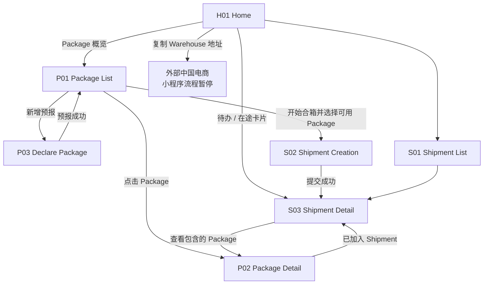

# 低保真 Wireframe 概览

> 本阶段只定义信息层级、任务入口、关键行动与状态反馈，不定义颜色、品牌、字体、组件视觉或技术实现。所有页面均来自已冻结的 V1 User Flow；Payment、Warehouse 与 Tracking 事件在作品集 V1 中以明确的模拟事件驱动。

## 设计目标

1. 让用户先看到当前需要处理的事，而不是功能目录。
2. 让用户在 10–20 个 Package 中快速区分未到仓、待确认、可合箱、已转运与需处理项目。
3. 让多个 Package 形成一个 Shipment 的选择、提交与锁定关系清楚可见。
4. 让每次 Shipment 都回答：现在在哪一步、我是否要行动、下一步是什么。
5. 明确 Payment、Dispatch 与 Delivered 是不同事实；出现业务异常时提供可行动的下一步。

## 最终 P0 页面

V1 保持 7 个 P0 页面。Quote、Payment、Tracking Timeline、英国地址与 Exception 都是某次 Shipment 的上下文，不拆成额外页面。

| ID | Page | User Goal | Entry | Exit | Primary Action |
| --- | --- | --- | --- | --- | --- |
| H01 | Home | 判断当前最需处理的任务，或进入正确起点 | 小程序启动；首页 Tab | Package List、Shipment Detail、外部电商 | 处理最高优先级待办 |
| P01 | Package List | 盘点并选择可合箱的 Package | 包裹 Tab；首页概览 | Package Detail、Declare Package、Shipment Creation | 开始合箱 |
| P02 | Package Detail | 了解单个 Package 的归属、状态与下一步 | Package List；关联 Shipment | Package List、Shipment Detail、按指引更正信息 | 查看关联 Shipment 或处理异常 |
| P03 | Declare Package | 用最少信息完成预报 | Package List；空状态 | Package List / 新建 Package Detail | 提交预报 |
| S01 | Shipment List | 查看所有转运的待办、在途与历史状态 | 转运 Tab；首页 Current Journey | Shipment Detail | 查看某次 Shipment |
| S02 | Shipment Creation | 将多个可用 Package 提交为一次 Shipment | Package List 的选择模式 | Shipment Detail；Package List | 提交 Shipment |
| S03 | Shipment Detail | 理解一次转运的当前状态、待办与后续履约 | Shipment List；Home；创建成功；关联 Package | Package Detail；Shipment List | 随状态变化：付款、查看 Timeline 或遵循异常指引 |

## 页面导航

## 页面关系原则

- **Home 是任务路由，不是功能入口集合。** 它只把用户送往需要处理的 Package 或 Shipment。
- **Package List 是批量决策页。** P02 只解释一件 Package 的事实与下一步；不在详情页承担合箱选择。
- **Shipment Detail 是一次转运的事实中心。** 不另建 Quote、Payment、物流、异常页面，避免用户在同一 Shipment 的上下文间跳转。
- **外部购物不被伪装为小程序能力。** 用户复制 Warehouse 地址后前往电商平台；回到小程序的下一步是 Package 预报。

## 低保真验证重点

| 重点 | 需要在 Wireframe 中成立的判断 |
| --- | --- |
| Package 可见性 | 用户能在列表首屏与筛选中判断每件 Package 是否可合箱。 |
| 多件选择 | 选择 8 件时，用户仍能看见还有 2 件可合箱但未选择，避免无意遗漏。 |
| 付款与离仓 | 付款成功后页面仍明确显示“等待仓库实际出库”，不使用“已发货”混淆。 |
| 追踪 | Shipment 以一条连续 Timeline 表达履约，不要求用户寻找独立物流页。 |
| 异常 | 用户知道问题影响的对象、是否要行动以及下一步，而不是只看到“异常”。 |
