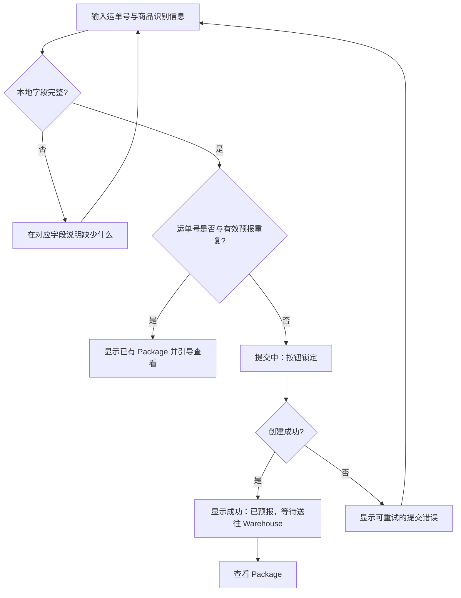

# Package Declaration 低保真结构

> 预报的目标不是收集完整电商订单，而是以最低输入成本提供 Warehouse 匹配所需的最小线索。它明确表示“已预报”而不是“已到仓”。

## 页面结构

```text
┌──────────────────────────────────┐
│ ‹ 预报 Package                    │
│ 下单后填一次，方便 Warehouse 核对归属│
├──────────────────────────────────┤
│ 国内运单号 *                       │
│ [请输入国内快递运单号             ] │
│                                  │
│ 商品识别信息 *                     │
│ [上传订单截图]  或  [填写简短说明] │
│ 用于核对 Package 与用户归属         │
│                                  │
│ （可选）备注                       │
│ [仅填写核对所需的信息             ] │
├──────────────────────────────────┤
│ 提交后状态为“已预报，等待送往仓库”  │
│ [提交预报]                         │
└──────────────────────────────────┘
```

## 字段边界

| 字段 | Required | 目的 | 低保真规则 |
| --- | --- | --- | --- |
| 国内运单号 | 是 | 将用户预报与 Warehouse 收货核对关联 | 输入时去除首尾空格；提交前校验非空与基本格式。具体承运商格式仍是 Product Assumption。 |
| 商品识别信息 | 是，二选一 | 给 Warehouse 提供订单或物品归属线索 | 用户提交订单截图，或填写一句最小商品说明；不要求完整商品清单。 |
| 备注 | 否 | 补充极少量与匹配有关的信息 | 不把备注设计成必填长文本，也不承诺 Warehouse 会按备注执行服务。 |

账号已关联的个人 Warehouse 识别信息不在此页重复填写。若实际业务需要额外信息，应在未来业务验证后补充，不能在 V1 用长表单猜测。

## 提交流程



## 输入、校验与反馈

| 场景 | 页面行为 | 用户反馈 | 下一步 |
| --- | --- | --- | --- |
| 缺少运单号 | 提交按钮可点击后显示字段级提示，焦点回到输入框 | “请填写国内运单号” | 补充运单号 |
| 缺少商品识别信息 | 明确要求上传截图或填写简短说明 | “请提供订单截图或商品说明，便于核对归属” | 二选一补充 |
| 运单号格式明显无效 | 不创建 Package | “请检查运单号格式” | 修改后重试 |
| Duplicate Tracking Number | 不新建第二个 Package；显示已有记录的状态与末位 | “该运单号已预报，无需重复提交” | 查看已有 Package |
| Submission Success | 创建 Package，状态为“已预报” | “预报成功。国内包裹到 Warehouse 后将进入确认流程。” | 查看 Package List / Detail |
| Submission Error | 保留已输入数据；不将未知结果写成成功 | “暂未提交成功，请重试” | 重试；持续失败时查看支持指引 |

## 成功页 / 成功反馈

成功后不需要新增成功页面；采用当前页成功反馈后跳转至新建的 Package Detail 或 List，避免额外页面。

```text
┌──────────────────────────────────┐
│ ✓ 预报已提交                       │
│ 国内单号 •••• 4821                 │
│ 当前：已预报，等待送往 Warehouse    │
│ 国内物流显示送达，不等于已可合箱     │
│ [查看 Package]  [继续预报]          │
└──────────────────────────────────┘
```

## 错误边界

- **Technical Error**：提交失败、网络中断或结果未知时，保留表单，显示重试反馈；不创建“信息异常”业务状态。
- **Business Exception**：预报提交后，Warehouse 无法完成归属匹配时，Package 才进入业务 Exception，并在 Package Detail 说明原因和下一步。
- 不提供“批量导入 Package”“自动读取电商订单”等能力；这些不在冻结 V1 范围。
