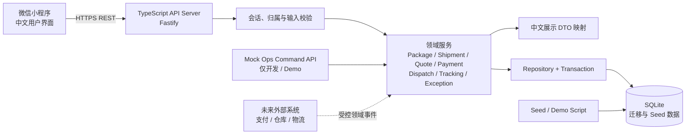

# V1 技术架构

> 本文把已冻结的 MVP 转化为可实现的技术边界。它不增加页面、用户能力或真实第三方接入。仓库、支付与物流事件的**来源**可以模拟，但 Package、Shipment、状态机、归属与锁定规则必须由服务端真实执行。

## 1. 架构目标与约束

- 支撑 7 个 P0 页面和一条 Package → Shipment → 签收的完整闭环；
- 状态只能经受校验的业务服务变更，不能由页面或脚本直接改表；
- 开发、演示与本地运行成本低，结构仍可清楚展示领域建模能力；
- 所有用户可见的标题、状态、提示和错误由中文文案映射层生成；
- 真实 Payment、仓库、国内/国际物流、清关和英国末端系统不在 V1 接入范围；
- Prototype 保持独立，只作交互参考，不复用为生产代码。

## 2. 推荐技术栈

| 层 | 选择 | 理由 |
| --- | --- | --- |
| Client | 微信原生小程序 + TypeScript + 官方 `wx` API | 与交付形态一致；页面少，不需要为了 MVP 引入复杂跨端框架。 |
| API Server | Node.js 20 + TypeScript + Fastify | 单体服务即可承载 API、领域服务和 Demo Ops；Fastify 适合轻量、类型明确的 REST API。 |
| 输入校验 | Zod | 在 API 边界集中校验请求，避免把不可信输入带入领域服务。 |
| Persistence | SQLite + Drizzle ORM / SQL migration | 单人作品集可本地一键运行；关系、唯一约束、事务和索引均适合本 MVP。迁移脚本保留后续切换 PostgreSQL 的路径。 |
| 测试 | Vitest + Fastify inject API tests | 不依赖真实网络即可验证规则、接口与端到端验收场景。 |
| 本地配置 | `.env` + 可提交的 `.env.example` | 区分本地数据库路径、Demo 会话和 Ops 密钥，不把真实密钥写入仓库。 |

这是面向 Portfolio MVP 的模块化单体，不引入微服务、消息队列、缓存集群、真实支付 SDK 或物流 SDK。

## 3. Client

微信小程序只负责用户任务和呈现：

- 首页聚合待处理事项、当前转运、包裹概览和中国仓地址；
- Package 的预报、列表、详情、筛选和多选；
- Shipment 的创建、地址填写、详情、报价、模拟付款、时间线和异常说明；
- 调用 API、处理加载/重试、展示中文文案；
- 每次进入、下拉刷新或回到前台时重新读取当前事实。

小程序**不**负责：

- 判断 Package 是否能锁定、是否归属当前用户；
- 任意推进 Package 或 Shipment 状态；
- 计算或改写 Quote；
- 把付款成功直接视为出库；
- 通过本地 Mock 数据伪造生产状态。

开发期使用 Demo Session 获取当前用户身份。未来可将会话交换层替换为微信登录，不改变 Package / Shipment API 的归属校验方式。

## 4. Backend

API Server 内部按职责分层，而不是按页面复制逻辑：

```text
HTTP Route
  → Authentication / Ownership Guard / Zod Validation
    → Application Service
      → State Transition Guard + Domain Rules
        → Repository / Transaction
          → SQLite
```

| 模块 | 责任 |
| --- | --- |
| Session / Access | 解析 Demo Session；取得 current user；拦截越权实体访问。 |
| Package | 预报、查询、到仓/匹配状态的读取与规则校验。 |
| Shipment | 草稿、合箱、地址快照、提交、取消、包裹锁定与释放。 |
| Quote / Payment | 记录最终重量、生成不可静默改写的报价快照、模拟付款尝试。 |
| Dispatch / Tracking | 出库资格校验、时间线事件和履约阶段推进。 |
| Exception | 创建阻塞问题、展示用户行动、解决后恢复至合法状态。 |
| Audit | 记录关键状态、归属、金额与操作变化。 |
| Mock Ops | 将受控 Demo 命令转换为上述服务调用；不直接写数据库。 |
| Presentation | 将内部状态、错误码和事件转换为中文用户 DTO。 |

## 5. Database

V1 使用单个 SQLite 数据库文件和迁移脚本。数据库负责最低层的：

- 主键、外键、唯一性与非空约束；
- 国内运单号、转运单号的唯一性；
- `shipment_package` 的有效归属唯一性；
- Quote 与 Address 对 Shipment 的一对一约束；
- 事务中的原子锁定、状态变更与审计记录。

Package 与 Shipment 的跨表规则仍由 Application Service 在同一事务内判断。SQLite 适合单进程 Portfolio MVP；未来多实例部署、并发量上升或需要备份/可观测性时再迁移到 PostgreSQL，不是 V1 前置条件。

## 6. Mock / Simulation Layer

Mock 的边界是外部事实来源，而不是业务规则。推荐由两部分组成：

1. **Seed / Demo Script**：建立 15 件 Package、不同阶段 Shipment 与异常场景，供页面演示和验收测试复现；
2. **受保护的 Mock Ops Command API**：仅本地开发或 Demo 管理环境可调用。每个命令通过领域服务执行，并写入状态、Tracking Event、Exception 与 AuditLog。

支持的命令包括收货、匹配、标记可合箱、开始处理、称重、生成报价、支付成功/失败、出库、运输阶段、签收、创建异常与解决异常。命令无权绕过状态机或直接更新表。

## 7. Future External Systems Boundary

| 外部能力 | V1 | 后续替换点 |
| --- | --- | --- |
| 微信登录 | Demo Session | Session adapter。 |
| 微信支付 | 模拟 Payment adapter | Payment provider adapter。 |
| 中国仓作业 | Mock Ops command | Warehouse event adapter。 |
| 国内物流 | Seed / Mock event | Domestic tracking adapter。 |
| 国际运输、清关、英国末端 | Seed / Mock event | Tracking provider adapter。 |

替换 adapter 只能产生已定义的领域事件；不能让第三方响应直接改 `shipment.status`。

## 8. Architecture Diagram



## 9. Non-goals

- 不建设完整仓库管理后台、客服系统或运营工作台；
- 不调用真实支付、物流、清关或英国末端 API；
- 不让小程序通过内部 Ops API 推进业务；
- 不把 Prototype 的静态数据当作生产持久化方案；
- 不为了“可扩展”提前拆分服务或增加消息基础设施。

