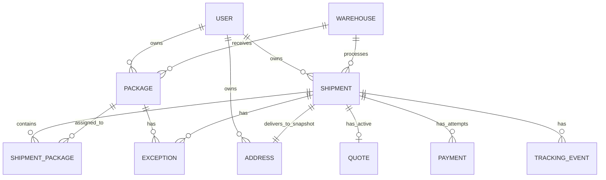

# 技术领域模型

> 本文把产品领域概念落实为技术实体与所有权边界。字段细节见 [03-data-schema.md](03-data-schema.md)。`Package` 和 `Shipment` 始终是不同实体：前者描述一件进入中国仓的实物包裹，后者描述一次跨境履约请求。

## 1. 实体与生命周期所有权

| Entity | Purpose | Core fields | Relation | Lifecycle ownership |
| --- | --- | --- | --- | --- |
| User | 当前使用者与数据访问边界 | id、external_subject、warehouse_recipient_code | 1:N Package、Shipment；1:N Address | Session / Access 模块创建和识别；用户不能读取他人实体。 |
| Warehouse | 中国仓的基础收件信息 | id、name、recipient_name、phone、address | 1:N Package、Shipment | Seed / 管理配置；V1 不做多仓调度。 |
| Package | 一件国内快递包裹及其到仓、归属、可选状态 | domestic_tracking_number、description / proof、status、version | 属于 User；可经 ShipmentPackage 进入一个有效 Shipment | PackageService；收货、匹配与异常由 Ops 事件触发。 |
| Shipment | 一次由多个 Package 组成的转运请求 | reference、status、final_chargeable_weight_g、version | 属于 User；1:N ShipmentPackage；1:1 Address、active Quote | ShipmentService；提交后 Package 被锁定。 |
| ShipmentPackage | Package 与 Shipment 的关联及有效锁定记录 | shipment_id、package_id、locked_at、released_at | 连接 Shipment N:M Package | ShipmentService；有效关联必须唯一。 |
| Quote | 付款时可核对的最终报价快照 | chargeable_weight_g、费用项、total、currency、version | Shipment 1:1 active Quote | QuoteService；生成后冻结，付款后不可静默重写。 |
| Payment | 对 Quote 的一次付款尝试与结果 | status、amount、provider_reference、idempotency_key | Shipment 1:N Payment；关联 Quote | PaymentService；V1 由 mock adapter 返回结果。 |
| Address | 本次 Shipment 的英国地址快照 | recipient、phone、postcode、address_line | Shipment 1:1；User 1:N | ShipmentService 在提交前保存；不是 P1 地址簿。 |
| TrackingEvent | Shipment 可见履约时间线上的一项事实 | stage、occurred_at、source、message | Shipment 1:N | DispatchService / TrackingService；按合法阶段顺序添加。 |
| Exception | 阻塞或影响一个 Package / Shipment 的业务问题 | target、resume_state、user guidance、status | Package 或 Shipment 1:N | ExceptionService；用户不能自行关闭。 |
| AuditLog | 不面向用户的关键操作追溯记录 | actor、action、before/after、reason、request_id | 可关联任一核心实体 | AuditService；只追加，不修改历史。 |

## 2. 关系

### 2.1 Package → Shipment 约束

- 一个 User 拥有多件 Package 和多张 Shipment；
- 一个 Shipment 在提交后包含一件或多件 Package；
- 技术上通过 `shipment_package` 表表示 N:M 关系；
- 业务上同一 Package **同时只能有一条 `released_at IS NULL` 的关联**，即只能属于一个有效 Shipment；
- 选择模式和未提交草稿不建立有效锁定；提交事务才创建有效关联并把 Package 改为 `IN_SHIPMENT`；
- 合规取消会设置关联的 `released_at`、把 Package 恢复为 `READY_FOR_SHIPMENT`，并保留关联历史；
- 已进入仓库处理或已出库的 Shipment 不允许通过 V1 自助释放 Package。

## 3. 领域对象边界

### User 与 Warehouse

用户不是仓库的运营人员。`Warehouse` 存公共仓地址，`User.warehouse_recipient_code` 存该用户用于收件匹配的个人识别信息。API 组合二者生成“我的中国仓收件信息”；它不创建 Package 或 Shipment。

### Package

Package 的状态只表达预报、到仓、归属、可合箱、进入 Shipment 或异常。它不记录跨境运输生命周期；一旦处于 `IN_SHIPMENT`，用户应从关联 Shipment 查看履约。

### Shipment

Shipment 承担提交、仓库处理、报价、付款、实际出库、运输、签收与异常。`DRAFT` 可以作为服务内或持久化草稿存在，但用户不能通过草稿绕过 Package 可用性校验。稳定转运单号仅在成功提交时生成。

### Quote 与 Payment

Quote 是 Shipment 的金额事实快照，Payment 是针对同一 Shipment 的尝试记录。允许多个失败/未知 Payment Attempt，但只允许一次成功 Payment。付款成功不会改变 Quote，也不会直接产生 Dispatch。

### TrackingEvent

TrackingEvent 只记录用户可理解的履约阶段或离仓/签收事实。它不是承运商完整原始回传存档。事件可带 `source=MOCK_OPS`，使 Demo 数据不被误读为真实物流。

### Exception

Exception 必须精确指向 Package 或 Shipment，保存恢复目标状态和中文用户行动信息。`EXCEPTION` 不是终态，也不是用户可点击“已解决”的状态。只有 ExceptionService 的 Resolve Event 可以恢复正常流程。

## 4. 领域事件与审计

每次关键变更均产生 AuditLog；需要用户看到的 Shipment 阶段同时产生 TrackingEvent。典型事件：

| Event | Owner | Minimum result |
| --- | --- | --- |
| PACKAGE_DECLARED | PackageService | Package 创建为 `DECLARED`；记录预报审计。 |
| PACKAGE_RECEIVED / MATCHED | PackageService | 到仓、匹配、可合箱状态可追溯。 |
| SHIPMENT_SUBMITTED | ShipmentService | 生成 Reference，锁定 Package，写审计。 |
| QUOTE_GENERATED | QuoteService | 冻结 Quote Snapshot，Shipment 待付款。 |
| PAYMENT_SUCCEEDED / FAILED | PaymentService | 写 Payment Attempt 与合法状态。 |
| SHIPMENT_DISPATCHED | DispatchService | 记录实际离仓和首个时间线事实。 |
| TRACKING_STAGE_UPDATED | TrackingService | 写时间线并推进 Shipment。 |
| EXCEPTION_RAISED / RESOLVED | ExceptionService | 阻塞 / 恢复工作流并写审计。 |

## 5. 生命周期所有权原则

1. 页面只能请求动作，不能提交目标状态；
2. Service 校验拥有者、当前状态、前置事实与并发版本；
3. Repository 在事务中更新实体、关联与 AuditLog；
4. Presentation 层将内部代码映射为中文 DTO；
5. Mock Ops 与未来外部 adapter 同样只能调用 Service。

