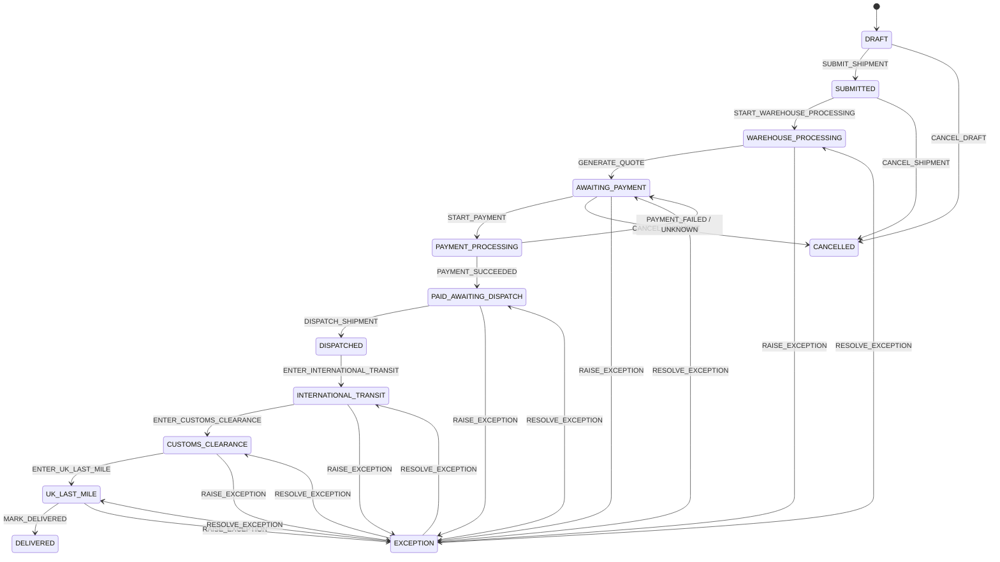

# 状态机实现设计

> 状态机是服务端领域规则，不由小程序提交目标状态。每一次转换必须校验当前状态、所有权、前置事实和阻塞 Exception，并在同一事务中更新实体版本与写入 AuditLog。面向用户的中文表达见 [07-user-facing-copy-mapping.md](07-user-facing-copy-mapping.md)。

## 1. 实现原则

1. Route 只接收业务动作，例如“提交转运单”或“记录出库”，不能接收任意 `status`；
2. `transition(entity, event, context)` 先查 Transition 表，再验证条件；
3. 发生并发冲突时不重试写入旧状态；返回冲突错误并让客户端刷新；
4. `EXCEPTION` 必须保存合法的 `resume_state`；解决时只允许返回该状态；
5. 外部事件与 Mock Ops 使用同一转换函数；
6. Dispatch、Tracking 及签收只能沿规定顺序前进。

## 2. Package States

| Code | 技术含义 | 可由何种服务产生 |
| --- | --- | --- |
| `DECLARED` | 最小预报已创建，尚无到仓事实 | PackageService.declarePackage |
| `INBOUND_TO_WAREHOUSE` | 已知正在送往中国仓 | Mock Domestic Event |
| `ARRIVED_PENDING_MATCH` | 仓库物理收货，尚未确认归属 | PackageService.receivePackage |
| `READY_FOR_SHIPMENT` | 已匹配、无阻塞问题、可加入转运单 | PackageService.matchPackage / markPackageReady |
| `IN_SHIPMENT` | 已锁定到已提交 Shipment | ShipmentService.submitShipment |
| `EXCEPTION` | 当前业务问题阻断正常流程 | ExceptionService.raiseException |

### 2.1 Package transition table

| From | Event | Condition | To | Side effect |
| --- | --- | --- | --- | --- |
| — | `DECLARE_PACKAGE` | 当前用户、运单号唯一、商品说明或证明存在 | `DECLARED` | 创建 Package；写审计。 |
| `DECLARED` | `MARK_INBOUND` | 无阻塞 Exception；Ops 身份 | `INBOUND_TO_WAREHOUSE` | 更新状态、时间、审计。 |
| `INBOUND_TO_WAREHOUSE` | `RECEIVE_PACKAGE` | Ops 记录收货事实；无阻塞 Exception | `ARRIVED_PENDING_MATCH` | 更新状态、收货审计。 |
| `ARRIVED_PENDING_MATCH` | `MATCH_SUCCEEDED` | 匹配到同一 User；无阻塞 Exception | `READY_FOR_SHIPMENT` | 记录匹配成功，审计。 |
| `READY_FOR_SHIPMENT` | `LOCK_IN_SHIPMENT` | Shipment 提交事务；该 Package 属于当前用户；无有效关联 | `IN_SHIPMENT` | 创建有效 `shipment_package`；递增 version；审计。 |
| `IN_SHIPMENT` | `RELEASE_FROM_SHIPMENT` | Shipment 处于允许取消状态；尚未开始仓库处理 | `READY_FOR_SHIPMENT` | 标记关联已释放；审计。 |
| 非 `EXCEPTION` 主状态 | `RAISE_EXCEPTION` | 目标实体存在且可记录恢复状态 | `EXCEPTION` | 创建阻塞 Exception，记录 resume_state，审计。 |
| `EXCEPTION` | `RESOLVE_EXCEPTION` | Ops 解决开放 Exception；resume_state 仍合法 | resume_state | 标记 Exception resolved；恢复状态；审计。 |

Package 不支持从 `DECLARED` 直接变为 `READY_FOR_SHIPMENT`，也不支持从 `READY_FOR_SHIPMENT` 直接变为 `ARRIVED_PENDING_MATCH`。这防止“已预报”“已到仓”“可合箱”被混写。

## 3. Shipment States

| Code | 技术含义 | 可由何种服务产生 |
| --- | --- | --- |
| `DRAFT` | 包裹与地址正在准备，尚未提交 | ShipmentService.createDraft |
| `SUBMITTED` | 用户已提交，等待仓库开始处理 | ShipmentService.submitShipment |
| `WAREHOUSE_PROCESSING` | 仓库开始检查、打包、称重 | Mock Ops / Warehouse event |
| `AWAITING_PAYMENT` | 最终重量与 Quote Snapshot 已准备 | QuoteService.generateQuote |
| `PAYMENT_PROCESSING` | 已发起付款，等待模拟结果 | PaymentService.createMockPayment |
| `PAID_AWAITING_DISPATCH` | 付款成功，但没有实际出库事实 | PaymentService.markPaymentSuccess |
| `DISPATCHED` | 仓库已实际出库 | DispatchService.dispatchShipment |
| `INTERNATIONAL_TRANSIT` | 国际运输阶段 | TrackingService.updateShipmentStage |
| `CUSTOMS_CLEARANCE` | 清关阶段 | TrackingService.updateShipmentStage |
| `UK_LAST_MILE` | 英国末端派送阶段 | TrackingService.updateShipmentStage |
| `DELIVERED` | 已取得签收事实 | TrackingService.updateShipmentStage |
| `EXCEPTION` | 业务问题阻断履约 | ExceptionService.raiseException |
| `CANCELLED` | 未出库前按规则取消 | ShipmentService.cancelShipment |

### 3.1 Shipment transition table

| From | Event | Condition | To | Side effect |
| --- | --- | --- | --- | --- |
| — | `CREATE_DRAFT` | 至少一件当前 User 的候选 Package；不锁定 | `DRAFT` | 创建/更新草稿；不生成 reference。 |
| `DRAFT` | `SUBMIT_SHIPMENT` | 至少一件 Package；地址完整；全部仍 `READY_FOR_SHIPMENT`；无有效关联；版本匹配 | `SUBMITTED` | 原子锁定全部 Package；保存地址快照；生成唯一 reference；审计。 |
| `DRAFT` | `CANCEL_DRAFT` | 当前用户 | `CANCELLED` | 不产生锁定；审计。 |
| `SUBMITTED` | `START_WAREHOUSE_PROCESSING` | Ops 身份；Package 锁定完整；无阻塞 Exception | `WAREHOUSE_PROCESSING` | 记录开始处理审计。 |
| `SUBMITTED` | `CANCEL_SHIPMENT` | 当前用户；仓库未开始处理 | `CANCELLED` | 释放所有 Package；标记关联 released；审计。 |
| `WAREHOUSE_PROCESSING` | `GENERATE_QUOTE` | 打包完成；最终计费重量大于 0；无阻塞 Exception；不存在 Quote | `AWAITING_PAYMENT` | 创建冻结 Quote Snapshot；审计。 |
| `AWAITING_PAYMENT` | `START_PAYMENT` | 当前用户；有效 Quote；无阻塞 Exception；无成功 Payment | `PAYMENT_PROCESSING` | 创建 PROCESSING Payment Attempt；审计。 |
| `AWAITING_PAYMENT` | `CANCEL_SHIPMENT` | 当前用户；未实际出库；无 Payment Processing | `CANCELLED` | 释放 Package；保留 Quote / 审计；不可继续付款。 |
| `PAYMENT_PROCESSING` | `PAYMENT_SUCCEEDED` | 对应 Payment 仍 processing；金额与 Quote 一致 | `PAID_AWAITING_DISPATCH` | 标记 Payment 成功；审计；**不写 dispatched_at**。 |
| `PAYMENT_PROCESSING` | `PAYMENT_FAILED` / `PAYMENT_UNKNOWN` | 对应 Payment 仍 processing | `AWAITING_PAYMENT` | 记录失败/未知结果；保留 Quote；审计。 |
| `PAID_AWAITING_DISPATCH` | `DISPATCH_SHIPMENT` | 成功 Payment、已打包、已称重、有效 Quote、无阻塞 Exception、存在实际离仓事实 | `DISPATCHED` | 写 dispatched_at；追加中文离仓 TrackingEvent；审计。 |
| `DISPATCHED` | `ENTER_INTERNATIONAL_TRANSIT` | Ops / adapter 事件，状态顺序正确 | `INTERNATIONAL_TRANSIT` | 追加 TrackingEvent；审计。 |
| `INTERNATIONAL_TRANSIT` | `ENTER_CUSTOMS_CLEARANCE` | 事件顺序正确 | `CUSTOMS_CLEARANCE` | 追加 TrackingEvent；审计。 |
| `CUSTOMS_CLEARANCE` | `ENTER_UK_LAST_MILE` | 事件顺序正确 | `UK_LAST_MILE` | 追加 TrackingEvent；审计。 |
| `UK_LAST_MILE` | `MARK_DELIVERED` | 签收事件存在 | `DELIVERED` | 追加中文签收 TrackingEvent；审计。 |
| 可阻断主状态 | `RAISE_EXCEPTION` | 记录影响与合法恢复状态 | `EXCEPTION` | 创建开放 Exception；审计。 |
| `EXCEPTION` | `RESOLVE_EXCEPTION` | 由 Ops 解决；目标恢复状态仍可达 | resume_state | 标记解决；恢复；审计。 |

`PACKING_COMPLETED` 与 `RECORD_FINAL_WEIGHT` 是 `WAREHOUSE_PROCESSING` 内的事实事件：只记录 `packing_completed_at` 和 `final_chargeable_weight_g`，不自行跳过到待付款。

### 3.2 Exception 恢复

创建 Shipment Exception 时，调用方必须提供当前正常状态作为 `resume_state`。例如：

| 出现问题时原状态 | 解决后允许恢复 |
| --- | --- |
| `WAREHOUSE_PROCESSING` | `WAREHOUSE_PROCESSING` |
| `AWAITING_PAYMENT` | `AWAITING_PAYMENT` |
| `PAID_AWAITING_DISPATCH` | `PAID_AWAITING_DISPATCH` |
| `INTERNATIONAL_TRANSIT` | `INTERNATIONAL_TRANSIT` |
| `CUSTOMS_CLEARANCE` | `CUSTOMS_CLEARANCE` |
| `UK_LAST_MILE` | `UK_LAST_MILE` |

异常解决不会自动补造遗漏的运输事件，也不会跳过付款或实际离仓。

## 4. Illegal Transitions

服务端必须拒绝并记录下列代表性非法动作：

| Illegal attempt | Reason | API behavior |
| --- | --- | --- |
| `AWAITING_PAYMENT → DISPATCHED` | 未产生成功 Payment 与实际离仓事实。 | 返回业务校验错误；不写 TrackingEvent。 |
| `PAID_AWAITING_DISPATCH → DELIVERED` | 跳过出库、运输、清关和末端阶段。 | 返回非法状态转换。 |
| 非 `READY_FOR_SHIPMENT` Package 进入 Shipment | 包裹未完成归属或已有问题。 | 返回具体包裹不可选原因。 |
| 同一 Package 二次锁定 | 违反一个有效 Shipment 归属规则。 | 唯一索引 + 事务回滚。 |
| `WAREHOUSE_PROCESSING` 后自助取消 / 移除 Package | 已进入仓库作业边界。 | 返回中文限制说明。 |
| 用户将 Exception 标记为已解决 | 解决需要 Ops 事实。 | 不提供用户 API；403 / 业务错误。 |
| 任意客户端传入 `status` | 状态只能由事件与服务决定。 | Schema 拒绝未知/禁止字段。 |

## 5. State Diagram

